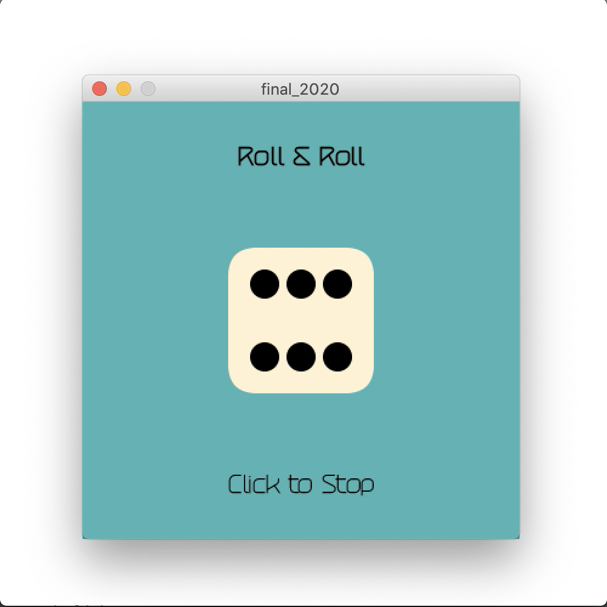
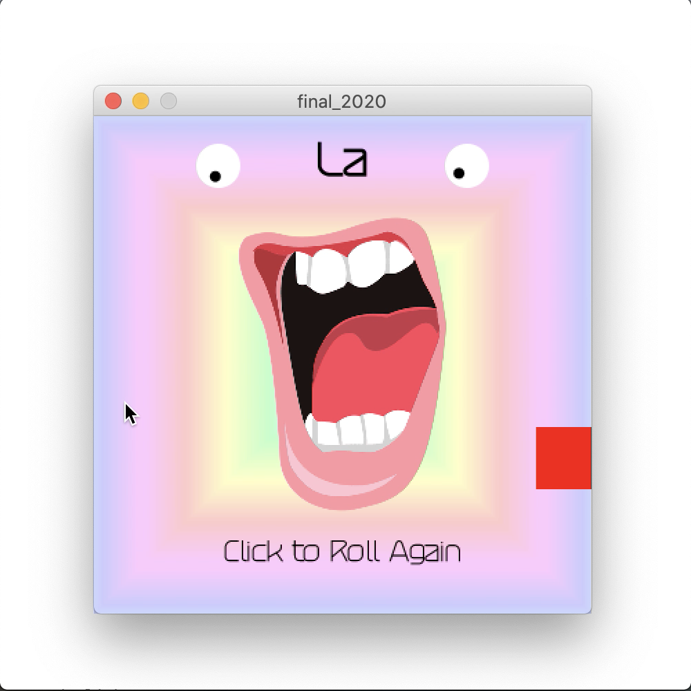

# Roll & Roll

## Update: May 17
 

For our final project, we were allowed to create anything on Processing. After discovering this amazing [website](http://david.li/) by David Li, I decided to re-create his Choir example. You can take a look at the sample [video](https://youtu.be/6Vl5vUaTJRU) and the [code](/FinalProject/final_2020.pde),

### Features
The user first clicks to roll a 7-sided dice, and the resulting side (1 through 7) is the starting note that determines in which key the music will play (1 as C, 2 is D, all the way up to 7 as B). Once the result is shown, the program maps the dice result to the starting frequency, from which it calculates the frequencies of all other notes through their number of half steps away from the starting note.

The 4 note chord that is being played on the subsequent screen is determined by the mouseY. As the user moves it up and down, you can see that the program plays the [movable do](https://en.wikipedia.org/wiki/Solf%C3%A8ge#Movable_do_solf%C3%A8ge) up to the upper do. To assist their experience, the screen displays the name of the note on the top and the red box on the right.

Other things that are worth noting:
1. Eyes follow the mouse cursor
2. Mouth gets reshaped by the mouse cursor
3. Volume of sound is determined by mouseX
4. Background keeps shifting through the [HSB color mode](https://en.wikipedia.org/wiki/HSL_and_HSV)

If the user wants to switch to a different starting note/key, the user can click again to restart and roll the dice again.

### Challenges
First, determining what chords will sound nice was difficult. I had to figure out a way to maintain the effect of going up the scale with the leading note, while building harmonies on the bottom, all within the same key. At the same time, I had to make it exciting by adding clashes and resolves. Thankfully, I managed to do a crash course on music theory with the help from my friends, and I am proud of the way the chords sound.

Second, working out loop() and noLoop() was a huge pain. After stopping the loop for rolling the dice, the program will display the result but once it started looping again, it would reassign the result variable before moving on to the next screen, which changed the notes that should have played. After much troubleshooting, however, I managed to stop the loop after mouse click, present the display, and then move on to the music screen after another mouse click where the program will loop again. Figuring this out took a long time.

### Reference
This final project took a lot of inspiration from various existing projects and reference pages, which I have listed below.

[Source Inspiration: Choir by David Li](http://david.li/)

[Processing Reference for Sound](https://processing.org/reference/libraries/sound)

[How to Calculate Sound Frequencies from MTU Physics](https://pages.mtu.edu/~suits/NoteFreqCalcs.html)

[Background Example on Processing Reference](https://processing.org/examples/radialgradient.html)

[Eyes Example on Processing Forum](https://discourse.processing.org/t/makes-eyes-follow-mouse-cursor/13816)

[Dice Example on OpenProcessing](https://www.openprocessing.org/sketch/100534/)

[Mouth Image](https://dlpng.com/png/1180891)

[Dice Roll Sound](http://soundbible.com/tags-rolling-dice.html)

## Update: May 7
The sample [video](https://www.youtube.com/watch?v=I_pv9aQdcJg) does not have the sound yet, but if you run the [code](/FinalProject/may5.pde), you can see that each starting note plays a chord of 3 notes.

Current features are:

1. mouseX determines the volume
2. mouseY determines:
    - the chord being played
    - the size of mouth image
    - the red box and text displayed

Future steps that I see are:
1. Make the background more interactive and fun (perhaps using Pixels)
2. Add a "direction" feature so that scale up sounds different from scale down based on music theory
3. Do some research on math behind scale to add some interactive element that can determine the key (starting Do)
