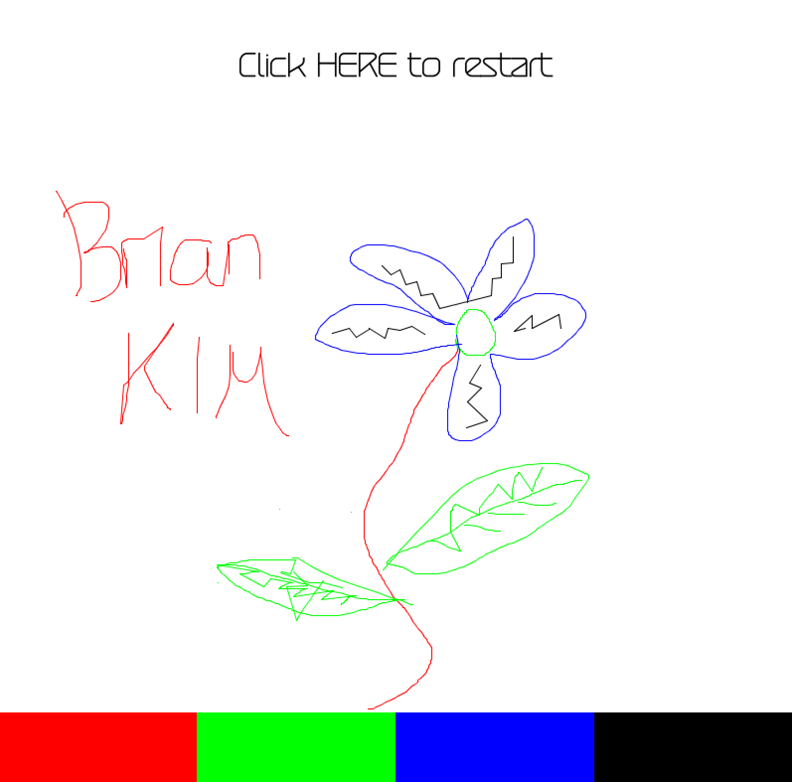

# Sketchbook

We were asked to mess around with Professor Aaron Sherwood's code from his guest lecutre and create something new. What I ended up with is a sketchbook.

## Process
*It will be useful to have both the [original code](https://github.com/aaronsherwood/introduction_interactive_media/blob/master/processingExamples/drawing/connectedLines/connectedLines.pde) and [my code](/dueApril21/sketchpad.pde) side by side to see what I describe below.

As I was messing around with the rotate function and how mouseX and mouseY would play a role, I realized that some variables no longer started working.
So I weeded those out until essentially I only had varibles X and Y left for the Rotators.
Then, I realized that it kept drawing lines following my mouse despite that I had so many rotators. So I even brought the number down to 2, and voila, it still worked fine.

## Features and Discoveries
My first instinct after this realization was to create some kind of sketchbook out of this. So I incorporated some mouseClicked and mousePressed for users to be able to change colors and restart if needed.
It seemed like it was a smooth sketchpad, where one clicks and drags the mouse, and upon release, the drawing stops.

BUT THEN! I was clicking at random points and realized that lines were... forming? Despite that I wasn't dragging the mouse.
After some experiment, I realized that because I developed this code based on Aaron's checking distance between the rotators in the drawLine function, I was continuously drawing small line between mouse coordinates which made them look like nice curves.

To test this, you can simply click in one place and then another place within the distance specified in the drawLine function, and you will see a line.

So these two different methods (1 - drawing by dragging mouse; 2 - clicking nearby coordinates) were how I drew this flower above. You can probably tell where I used which method.

## Special Thanks to
Professor Aaron Sherwood
