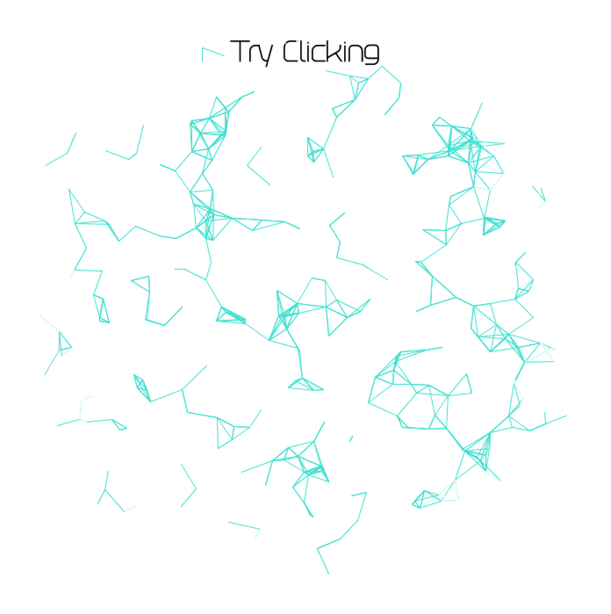

# Doodle

We were asked to mess around with Professor Aaron Sherwood's code from his guest lecutre and create something new. What I ended up with my own version of the art.

Video is available [here](https://youtu.be/UFFMIZhgzIE).

## Process and Features
*It will be useful to have both the [original code](https://github.com/aaronsherwood/introduction_interactive_media/blob/master/processingExamples/drawing/connectedLines/connectedLines.pde) and [my code](/dueApril21/doodle.pde) side by side to see what I describe below.*

As I was messing around with the colors, I realized that I could easily finesse letting the user mess around with the color of the lines easily. So when a mouse is clicked, I generate a new color value determined by their mouse position as well as some random number.

Then, I decided to play around with distances - a distance between the rotaters themselves as well as the distance between a rotater and a mouse. So I added these elements into the constructor, so each rotater has its own unique value for these.

Once I did this, I wanted to do something nice with these new unique values. So I decided to use these distances in the line drawing itself. So only the lines that are close to the mouse display and the far ones hide (by changing the color to the background color). I decided that hiding the color was the easiest way to manipulate showing and hiding rather than messing around with the line() function. 

## Discoveries
This was not that difficult to do thanks to Professor Sherwood's great starting code. But what I ended up creating asks for a different kind of interaction from the user and the artwork. It is really cool that by trying things out with a few functions can create something completely new and refreshing.

## Special Thanks to
Professor Aaron Sherwood
