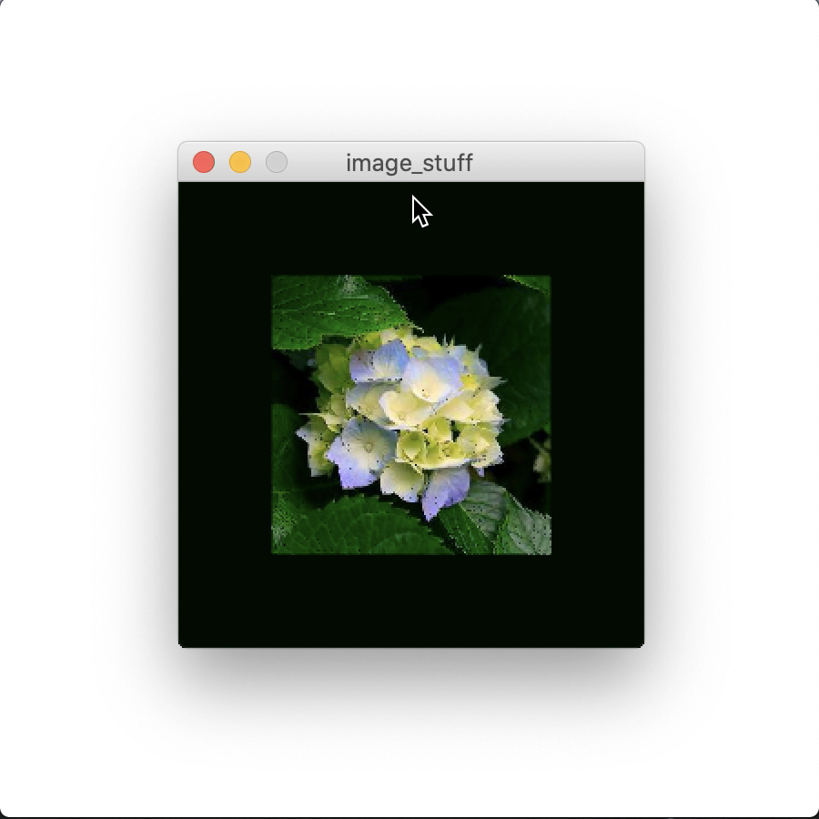

# Explosion!

## Goal
We were asked to do something creative with an image using pixels. I utilized the Processing's extensive [documentation about pixels](https://processing.org/tutorials/pixels/) and tweaked their last example of 3D explosion to do something cool.

My main goal was to understand the code, and simplify it as much as I can by getting rid of unnecessary variables, while also adding creative features of my own.

## Video and Images
Video is available [here](https://youtu.be/Je51REwtkBU).

I found the image for the [flower](/dueApril30/lily.jpg) on a twitter account called [Fraser Flowers](https://twitter.com/fraserflowers1).

2D and 3D

Scale Down and Scale Up

## Features
The code can be found [here](/dueApril30/image_stuff.pde).

The Pixels tutorial already has the code for 3D explosion, so I just tried to understand each step and comment things that could be helpful.
The tutorial version allows the user to create a 3d effect by adjusting z value based on mouseX, but I changed it to mouseY instead.
So as they go from 0 to height value, the brighter colors come forward, and the darker colors stay back.

Two features I added to my version are:
1) Background color - mouseX and mouseY determines which pixel of the image the background color is grabbing. So as the user moves around the canvas to adjust scale and z value, they are also changing the background color.
2) Scale - mouseX determines the scale of the each cell/rect that is being drawn. So as they go from 0 to width value, the cells go small (basically nothing) to big and more defined. This allows even the 3D shape to retain the flower image instead of a cool pixelated explosion.

## Challenges
I wanted to make the size be dynamic to the image that is being loaded instead of hard coding the dimensions of the image.
So I tried img.width and img.height, but apparently on Processing, size must have actual numbers as arguments and not variables (even final variables that do not change).
That was disappointing.

## Reference
Pixels on Processing: https://processing.org/tutorials/pixels/

Image for the flower: https://twitter.com/fraserflowers1
