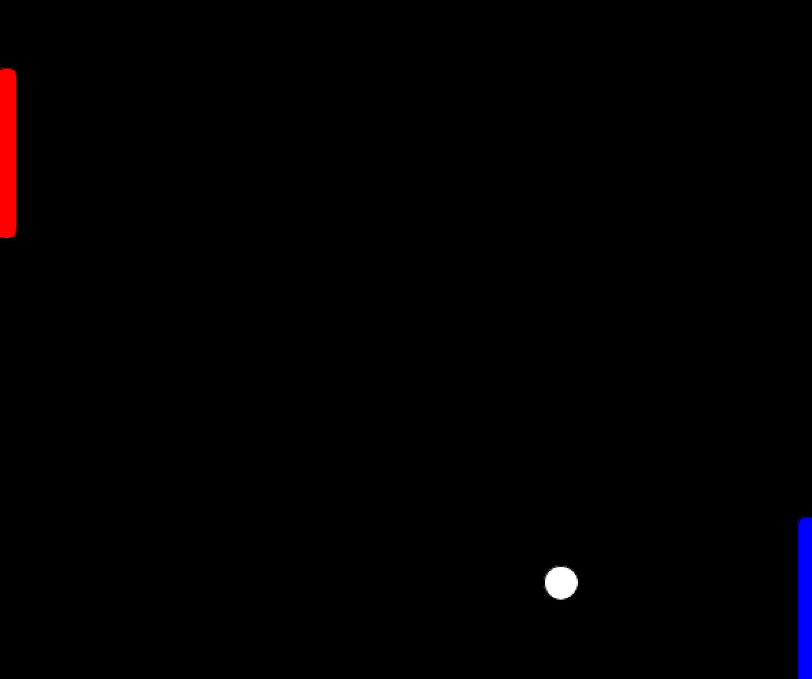
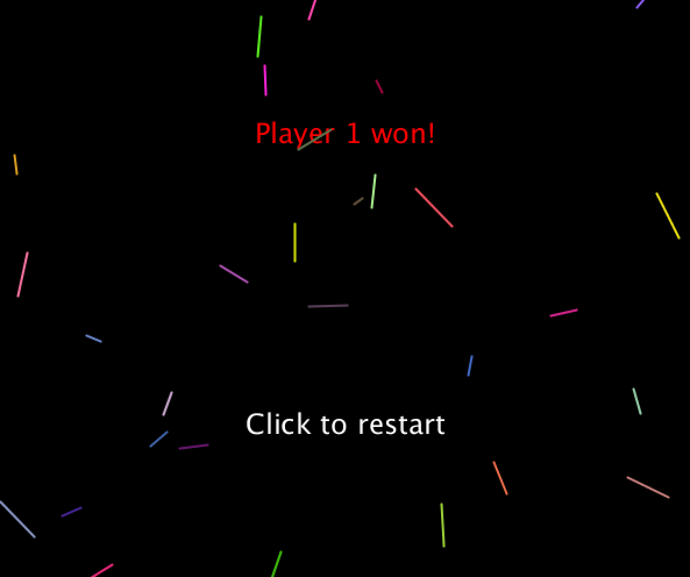

# Ping Pong

## Concept
For this week's assignment, we were asked to use Object-Oriented Programming (OOP) on Processing to create something fun, whether that be an artwork or a game.
I decided to create a 2-player ping-pong (not sure how else to call this game) where two people use the keyboard to hit the ball to the other person.

## Features
First, an instruction sheet will show up, explaining how the game goes. Pretty self-explanatory - 'w' and 's' are up and down for player 1, UP and DOWN arrow keys are for player 2.
Once they click on the screen, the game is initialized.

The red bar is player 1, and the blue bar is player 2. To make this more exciting and challenging, the ball gets faster every time it hits any kind of surface, either the players or the top/bottom of the screen. 

If the player fails to hit the ball, then the game over screen is displayed with the sparkle confetti being thrown everywhere to celebrate.
Then, the players can click to restart the game.

## Challenges
The most challenging part of this was figuring out how to use the same keyboard for two players and how to make sure different keys being released and pressed correspond to their players.
This beautiful [website](https://happycoding.io/tutorials/processing/input#handling-multiple-keys) helped me figure out how to do so.

I did not manage to solve a bug that happens in very particular times, and I'm not sure what exactly causes it. It happens usually when the player barely hits the ball but then continues to move in that same direction.

I think it has to do with the ball's coordinate changing at a different speed from the player's coordinate and thus causing some irregularities with the inequalities for updateBall() function. But again, this is my speculation.

## Video and Code
Here is a [video](https://youtu.be/5z4TurZe_50) of me trying to play both players at the same time.

Click [here](/dueApril7/oop_game.pde) for the full code on Processing.

**Special thanks** to Amy Kang who let me use parts of the code from her [previous assignment](https://github.com/skang0531/IntroToIM/tree/master/March31).

## Reference
[Handling multiple keys](https://happycoding.io/tutorials/processing/input#handling-multiple-keys)

[Amy Kang's sparkle](https://github.com/skang0531/IntroToIM/tree/master/March31)
