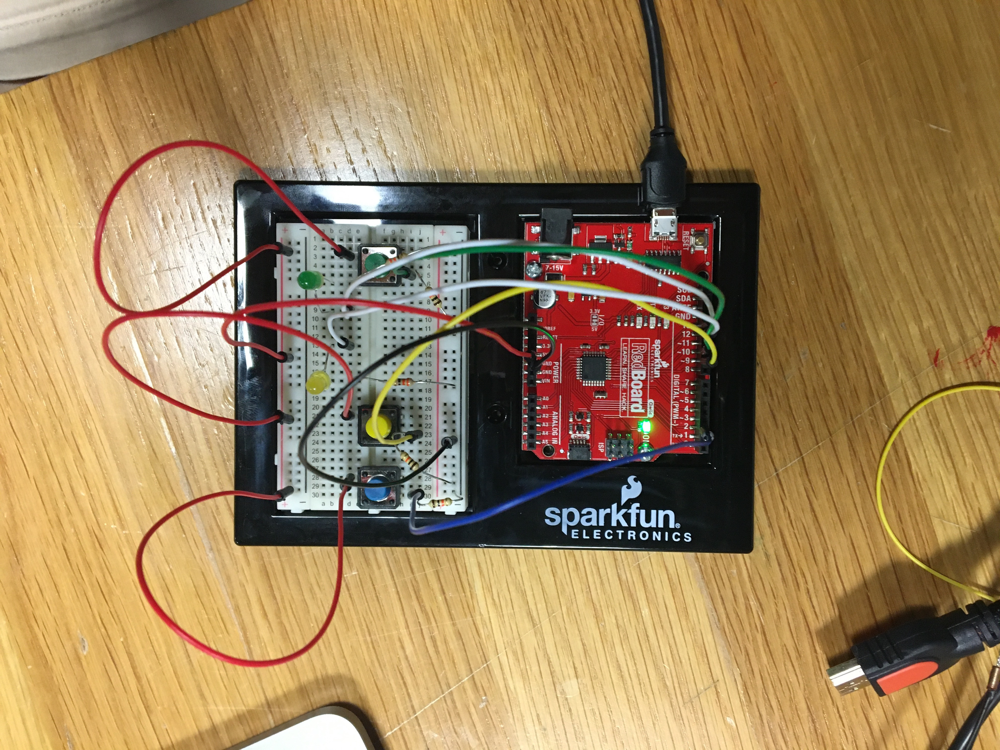

## Description

For our second assignment, we were asked to create a switch with digital inputs and outputs. So I decided to create three buttons: green, yellow, and blue.

Green and yellow buttons correspond to the LED light (green lights green, yellow lights yellow).

If the blue button is pressed, the LED lights alternate and blink.

I connected 10k resistors to the three switches and 330 resistors for the two LED lights. I used one wire for 5V and one wire for the ground.

Below you can find the schematic of my switch as well as a picture of it. You can see the video [here](https://youtu.be/b7gzLwMhkNo).

