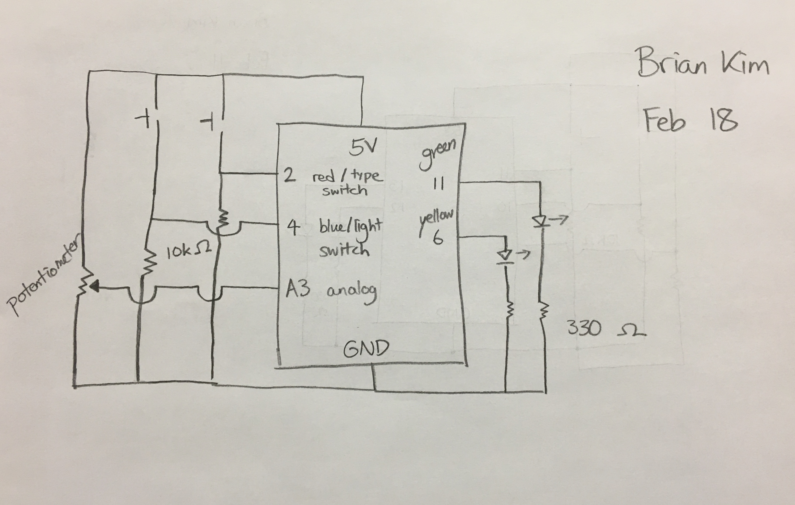
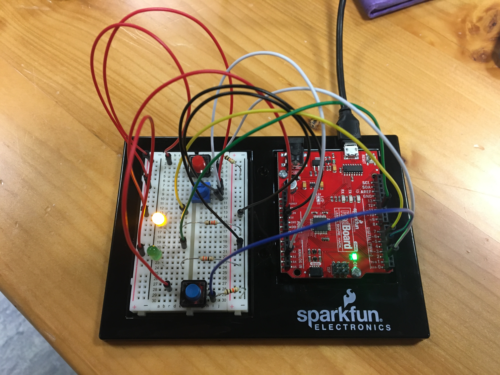

## Description

For our third assignment, we were asked to get information from at least 1 analog sensor and at least 1 digital sensor (aka switch), and use this information to control at least 2 LED lights, in both digital and analog fashion.

So I have a three-wire potentiometer as the analog sensor and two switches, 1 red and 1 blue, as digital sensors. The blue switch determines which LED light, yellow if off or green if on, will be on/affected, whereas the red switch determines the behavior that whichever LED light exhibits. 

When the red switch is not pressed, the LED light (either yellow or green depending on the digital input from blue switch) takes the analog input from the potentiometer to determine its brightness. In other words, if the input increases, the LED light's brightness increases.

When the red switch is pressed, the LED light (again either yellow or green) blinks at a speed determined by the analog input from the potentiometer as the argument for the delay in the blink function.

Essentially, with the same analog sensor, you can exhibit two different behaviors, adjust brightness or blink, both of which accept analog input. But which light is on and which behavior is being exhibited is determined by the digital inputs from the switch. So this is a fun circuit that mixes analog and digital input as well as analog and digital output.

One problem I ran into was for the adjusting brightness behavior. As you switch between the lights, the unused LED light would still exhibit the brightness of the analog input from previous, so my solution was to create another variable called unusedLED that is determined by the blue (light) switch, and ensure that the unusedLED is turned completely off while the other LED adjusts brightness. Read more about it in the arduino code [here](/dueFebruary18/february18.ino). 

## Pictures and Video

As you can see in the schematic below, I connected 2 10k resistors, connected to the ground, to the 2 switches (pin 2 and 4), which are also connected to the 5V. And I connected 2 330 resistors for the 2 LED lights (pin 6 and 11). Of course, potentiometer is also connected to its pin (A3), 5V, and ground as well.

Below you can find a picture of the entire circuit. You can see the video [here](https://youtu.be/czehuKYVBEU).

