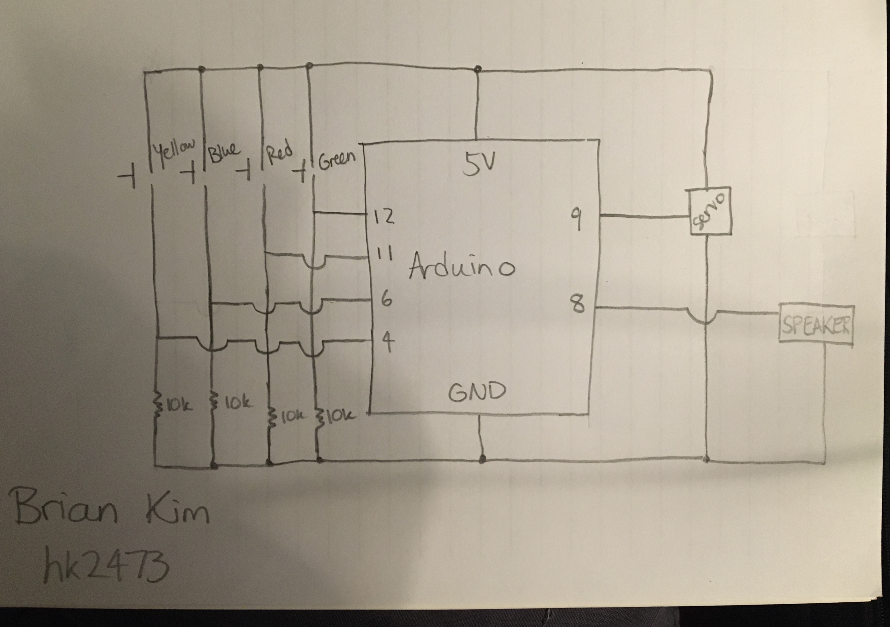
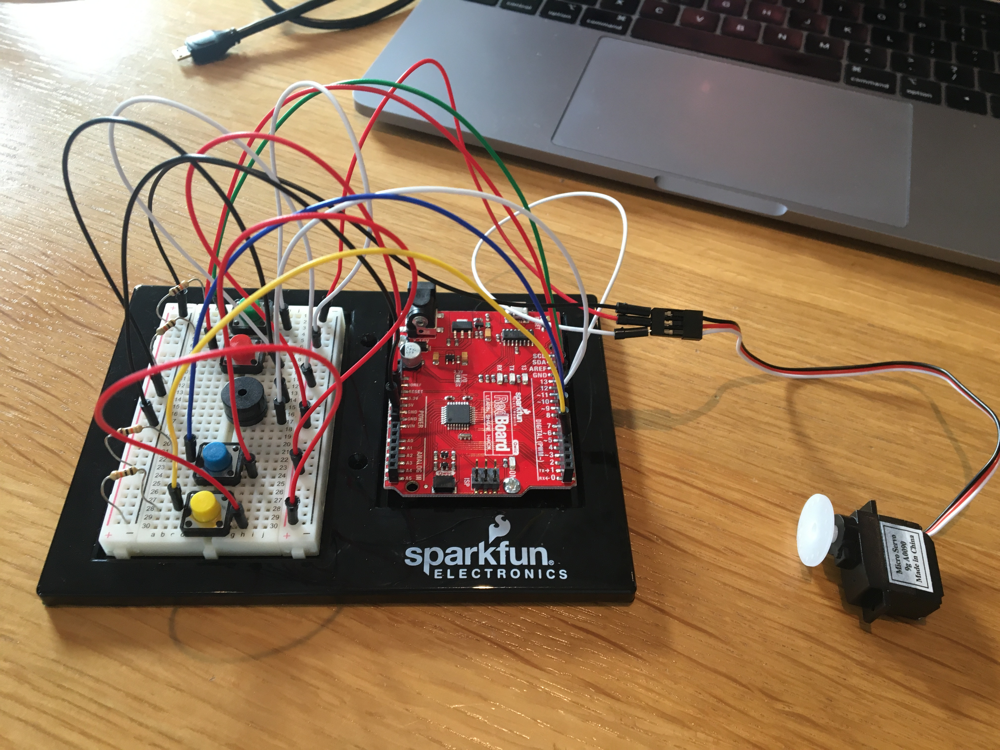
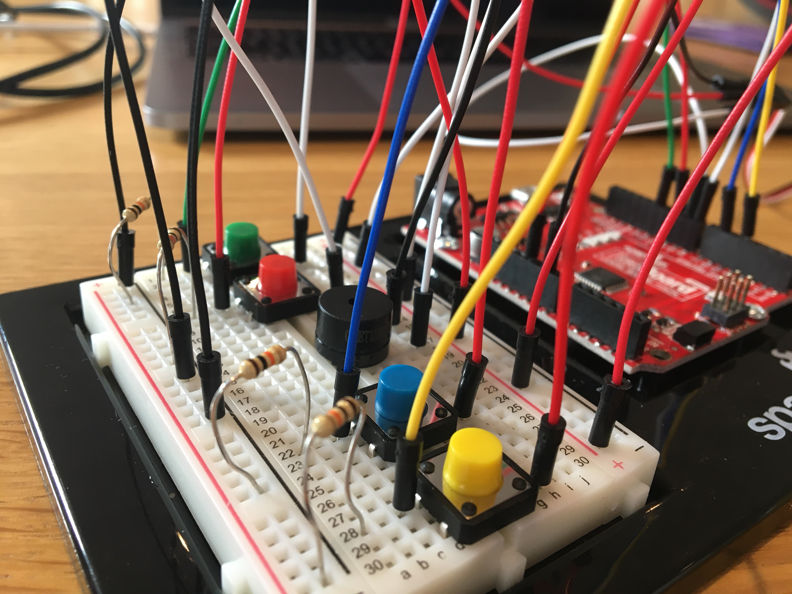

## Description

For our fourth assignment, we were asked to make a musical instrument using tone and one or more servos. Unlike previous assignments, I wanted to create something that was more puzzle-like. So I created a circuit that requires more thinking from the player to solve.

Initially in the setup, the speaker will play a melody once through (I'll give you a hint - it's the first half of "Twinkle, Twinkle, Little Star"). Then, once the melody is over, the player has to guess what to do. The objective is to get the servo motor to rotate, but there are no other hints or anything besides the melody that just played.

There are four switches: green, red, blue, and yellow. I designed the circuit, so that it looks like the four switches do something, but in reality, three of them are not even read in the code. The only switch that is read, and thus determines the behavior is the yellow switch because the star is yellow!!

I created a if/else statement, so that once the yellow switch is pressed even for a little bit, the second half of "Twinkle, Twinkle, Little Star" plays and the servo motor rotates. Once it's done, the player can press the switch again to observe the same behavior.

The biggest problem I ran into was figuring out how to get the serco motor and the speaker to work simultaneously. Due to for loops and delays, it was hard to figure out a logic system that made sense for the computer. But I eventually figured out a way to do so, which is to iterate through a for loop, and every iteration will playback a note as well as some movement for the motor. Read more about it in the arduino code [here](/dueFebruary25/musical-instrument.ino). 

## Pictures and Video

You can see a picture of the entire circuit as well as a close up of the breadboard below. You can see the video [here](https://youtu.be/Ilj9XaZuWbI).

