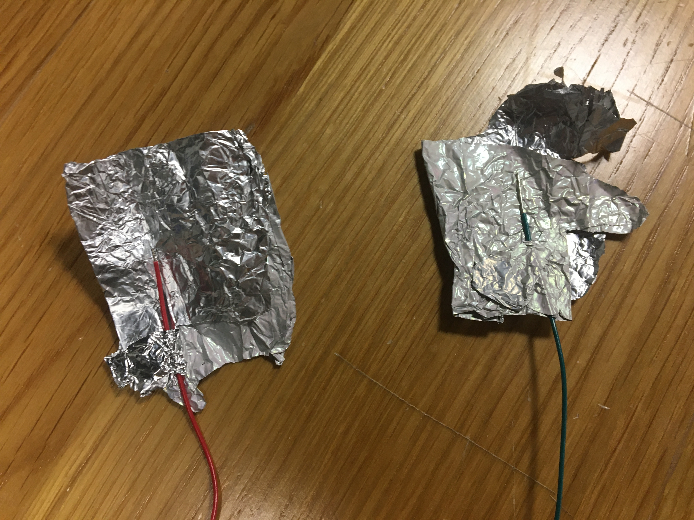
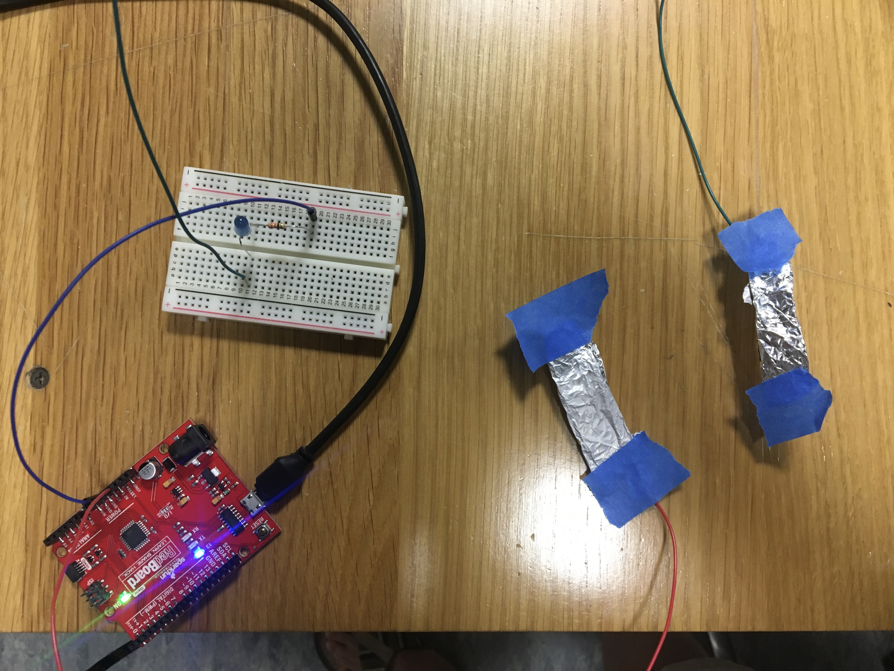

**Here is the description of my hands free switch**

**Cough Switch**

For our first assignment, we were asked to create a switch that does not use hands. So I thought about what should not use hands, and in light of recent concerns around the virus and health, I realized that coughing should not use hands. Coughing into our hands will spread more germs around, and the correct way to cough is to cough into your elbow.

Jump wires were too short for me to be connected to my body, so I got some single stranded wires instead. In addition, I needed to tape them on my body, so I decided to wrap them in aluminum foil to have enough surface area for the two wires to touch and close the circuit.

Besides the switch, the rest of the circuit is simple: redboard connected to my laptop, breadboard, jump wires, LED light, and resistor.

The LED light turns on when I bring my mouth towards the elbow to cough, consequently closing the circuit. Once I remove my mouth, the circuit is open, and the LED light turns off. You can see the video [here](https://youtu.be/Xws-Ke45sp4).

