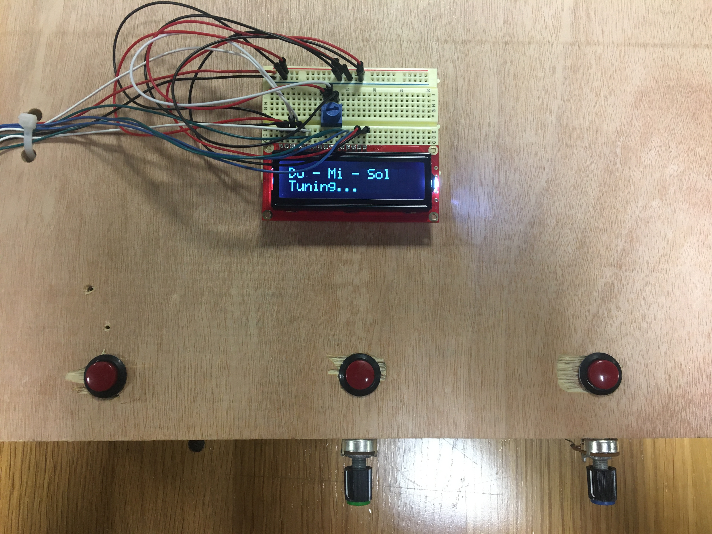
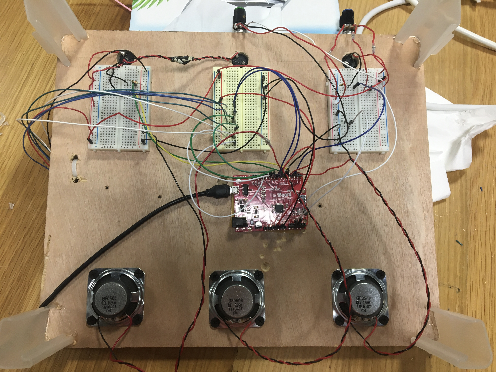

## Do-Mi-Sol

For our midterm project, we were asked to create something creative and fun and showcase all we have learned thus far. I really liked engaging the users in a quiz/puzzle manner from last time, so I decided to keep that element. Thus was created a pitch perfect training tool called Do-Mi-Sol.

It starts up by playing a starting pitch for a few seconds. There are three speakers, and your mission is get the other two speakers to play the starting pitch's major 3rd and 5th (hence the name Do-Mi-Sol). To tune, the user will have to dial the potentiometer. Once they succeed, the LCD screen congratulates the user.

Because Arduino does not let multiple tones to play at the same time, I had to devise a way to only have one pitch play at a time. I decided to have a switch for each speaker, so when one is pressed, the corresponding speaker will play its note, whatever it is currently tuned to. Also, for the 2nd and 3rd speakers, we want to change their pitch, so there are two potentiometers for the two speakers.

Building a physical platform was rather challenging, and one small decision led to many more hurdles. After drilling the speakers onto a wooden platform, I realized that the board was a little too thick for everything else, but I liked the way it looked. So I decided to drill big holes and glue the switches onto the board. For the potentiometer, I glued them in front of the corresponding switches, so the experience is more intuitive. Three small breadboards, one for each speaker/switch/potentiometer grouping, were taped on the bottom of the wooden platform with four legs (like a table), and a breadboard with the LCD screen was glued on the top for the user to see.

Regarding the code, the biggest problem I ran into was figuring out how to get the LCD screen to display a certain message at a certain condition. Due to the loop nature of Arduino, it was hard to use an if/else logic because the LCD screen would sometimes flicker every time the code looped. I could have just displayed the instructions ("Tuning...") in the setup only once, and if the user tunes both correctly, then "Congrats!" is displayed. One downside of this is that if the user turns the dial really fast and surpasses the good pitch zone, the code doesn't reset to default. So I decided against it and keep the original code. Although this would mean that the LCD screen might read a different if statement instead of the desired one when potentiometer's value flickers by 1 (due to its sensitivity), this would be a better result than having the LCD screen not update itself. Read more about it in the arduino code [here](/dueMar5/midterm.ino). 

## Pictures and Video

Here is a photo of the circuit for the project as well as the schematic. You can see the video [here](https://youtu.be/LRvRqs2pFu8).

