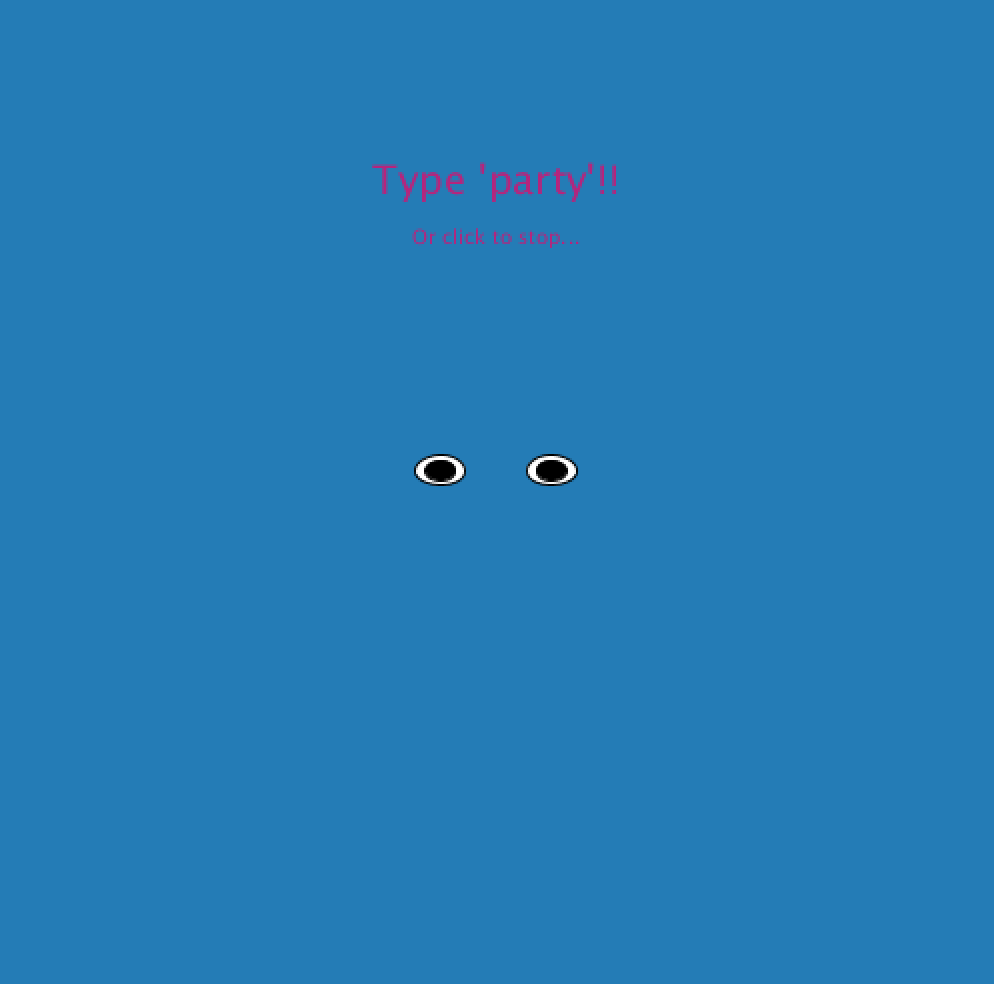

## Party Portrait!

For this week's assignment, we were asked to create a self-portrait using Processing. Instead of just creating some shapes that resemble my face, I decided to make it a little fun and add an interactive feature called Party Screen.

Check out the video [here](https://youtu.be/HtKwGqB7jCc).

Essentially, the setup is a grey background with my self-portrait displaying normally, and there is a simple text instruction that says "Click to start the party".

Once the user does, then the screen changes colors repeatedly. When the user follows the instruction and types in 'party' to celebrate, each character (i.e. 'p', 'a', and so on) will trigger a different facial feature to be displayed (a little creepy, no?)

Other examples are:

Once their eyes are tired of the color stimulation, they can click again, and the screen is back to the original setup - a grey background and my entire face.

Read more about the actual code [here](/dueMarch19/self_portrait.pde)
