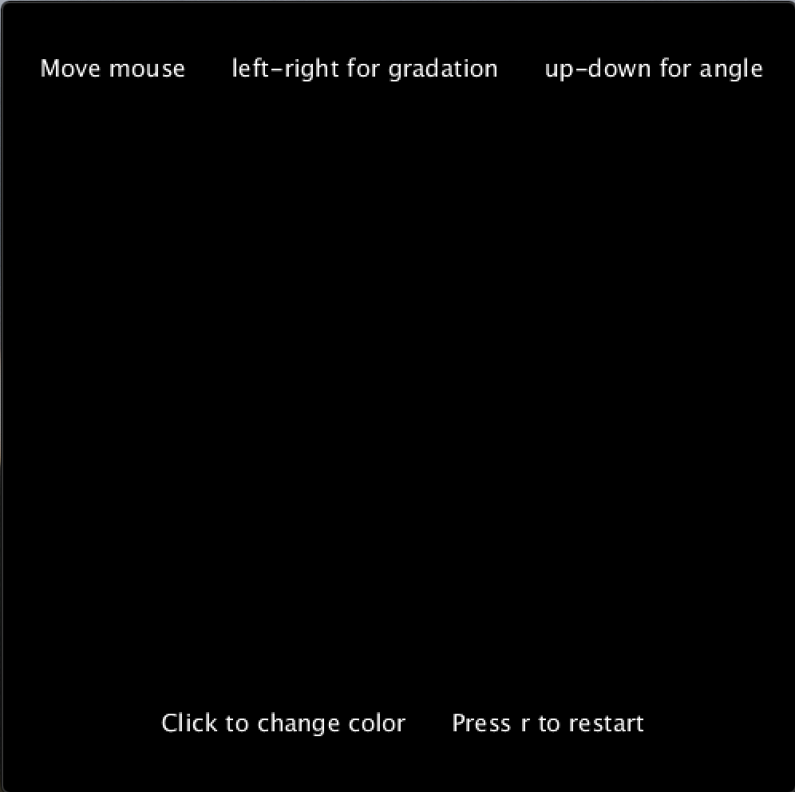

# Computer Generative Art

### Inspiration

For this week's assignment, we were asked to create a computer generative art and were given three sources for inspiration, which you can find [here](http://dada.compart-bremen.de/docUploads/ProgrammInformation21_PI21.pdf), [here](http://dada.compart-bremen.de/docUploads/COMPUTER_GRAPHICS_AND_ART_Feb1977.pdf), and [here](http://dada.compart-bremen.de/docUploads/COMPUTER_GRAPHICS_AND_ART_May1976.pdf).

What I liked about these artworks was that they were simple yet complicated. Simple lines and shapes overlapping creates something provoking. But I wanted to create something that demanded more interactivity and creativity from the user.

### Concept

I decided that my computer generative art will draw based on the [Perlin noise](https://en.wikipedia.org/wiki/Perlin_noise). By mapping two separate noise values to x and y coordinates, I translate the canvas at random to make the starting point generated by the computer on a black canvas.

Nonetheless, I wanted to give the user some element of willpower and choice. To give an illusion that the user is painting, the computer draws an ellipse of a small size that makes it look like a brushstroke, and the user can change certain attributes of the brushstroke, such as:

1) Color (black/white, red, green, blue) by clicking
2) Gradation of the chosen color by moving mouse left-right
3) Angle by moving mouse up-down

### Motivation
Creating an illusion of control in an uncontrollable world, this is the motivation behind my program. Although the user cannot control where they get to place the ellipse, they can still create some kind of art that they want.

At first, they might feel frustrated, but they can press r and have an empty canvas to start again. I added this feature, so that as they grow accustomed to how to move the mouse, they get another chance to try. I am really excited to see people try and create something unique, together with the computer.

Since this could be a bit complicated at start, I have added instruction which can be shown in the screenshot below. Also, check out the [video of me trying](https://youtu.be/L2C-IfeIo_8) as well as the [code](/dueMarch31/computer_art.pde).

